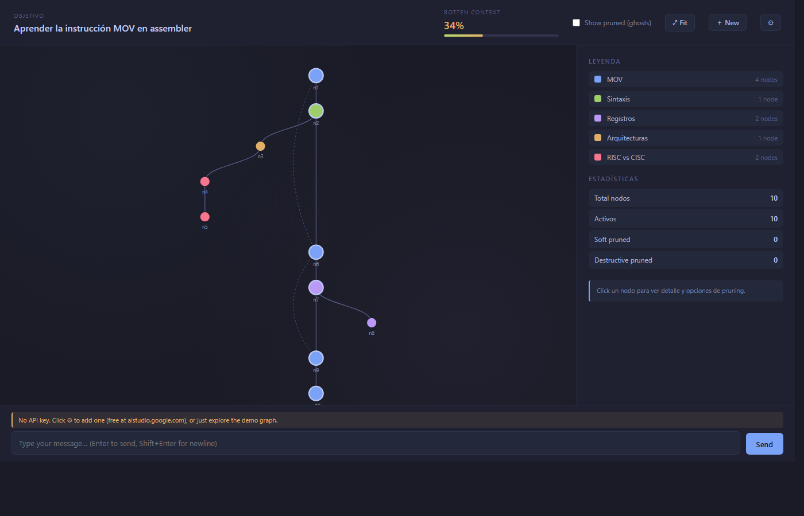
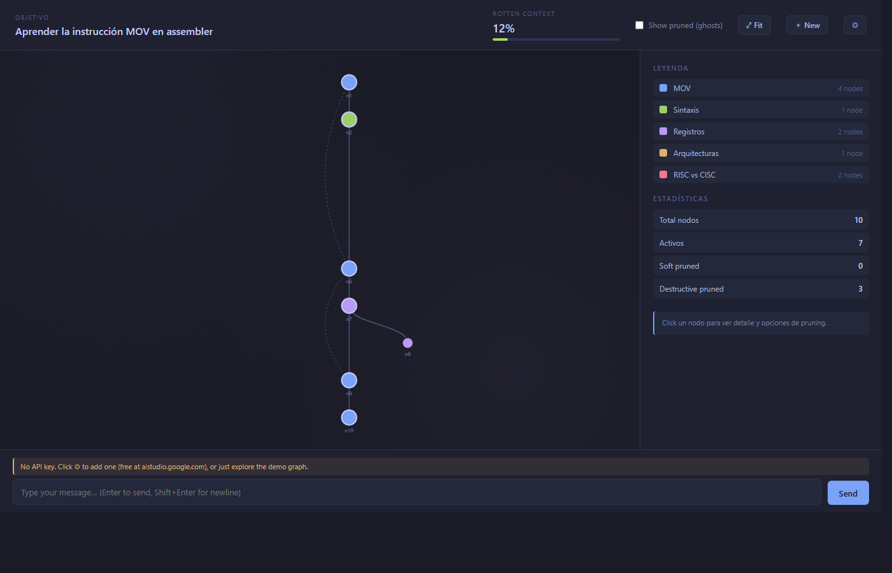

# bonsai

> Bonsai es el arte de podar un árbol para que crezca hacia una visión específica — no es jardinería pasiva, es escultura iterativa por sustracción. Eso es exactamente lo que hace esta herramienta: toma un árbol de conversación que crece sin control y te permite recortarlo para apuntar a un objetivo en concreto.

Una UI experimental para manejar el contexto de una conversación con un LLM como un grafo. Cada turno user/assistant es un nodo; las aristas conservan tanto el orden temporal como la similaridad temática (vía tags). Vos decidís qué ramas se mantienen y cuáles se podan, antes de que ensucien tu contexto.

## Demo

**Antes** — sesión sobre la instrucción `MOV` en assembler. El LLM se fue por la tangente a contar diferencias con ARM y de ahí saltó a RISC vs CISC. La barra de "Rotten Context" indica que **34%** del contexto activo no aporta al objetivo.



**Después** — un click en el nodo `n3` (la tangente sobre ARM) y "Prune subtree (destructive)" elimina toda esa rama de la conversación. El rotten context cae a **12%** y el grafo queda enfocado en el objetivo original.



## ¿Por qué?

En un chat lineal con un LLM, todo lo que escribiste y todo lo que respondió el modelo se acumula en el contexto. Si el modelo introduce una tangente interesante y vos la seguís por curiosidad, eso queda mezclado con tu objetivo principal y degrada las próximas respuestas. Las UIs de chat actuales no te dejan separar fácilmente el grano de la paja.

Bonsai modela la conversación como un grafo dirigido y te da herramientas para *podar* las ramas tangenciales:

- **Pruning destructivo** — la rama desaparece del contexto que ve el modelo.
- **Soft pruning (out-of-scope)** — la rama queda visible pero marcada como fuera de scope; útil para reversibilidad.
- **Restore** — devuelve la rama al estado activo.

Cada turno trae además metadata: un *tag* del tema, un flag de si fue tangente, y un score de relevancia al objetivo. Bonsai usa eso para colorear nodos por tema y calcular el *rotten context* — un indicador agregado de cuánta paja tenés acumulada.

## Quickstart

No hay build step. Es HTML + JS plano servido por cualquier servidor estático.

```bash
git clone https://github.com/andres-g-a/bonsai.git
cd bonsai
python -m http.server 5173
# abrir http://localhost:5173/
```

Por defecto carga una sesión mock (la del MOV en assembler) en modo demo. Podés explorar todas las features visuales sin API key — clickear nodos, podar, restaurar, hacer zoom/pan, etc.

### Conectar un LLM real

1. Crear API key en [aistudio.google.com](https://aistudio.google.com/) (free tier sin tarjeta).
2. **Opción A** — copiar el template y editar:
   ```bash
   cp config.example.js config.js
   # editar config.js con tu key
   ```
   `config.js` está en `.gitignore`.
3. **Opción B** — click en ⚙ (Settings) en la app y pegar la key. Se guarda en `localStorage`.

Una vez configurado, `＋ New` te deja arrancar una sesión nueva: definís un objetivo, escribís un mensaje, y cada turno llama a Gemini, parsea el JSON estructurado `{answer, tag, is_tangent, relevance, continues_from}`, y crece el grafo en tiempo real.

## Features

- **Grafo timeline + temático** — eje Y temporal, eje X por rama. Aristas sólidas siguen la jerarquía padre-hijo; aristas punteadas conectan nodos con el mismo tag separados por una tangente.
- **Pruning con preview** — al hacer hover en un nodo se ilumina en rojo todo el subtree que sería removido. Sin sorpresas al clickear.
- **Rotten context bar** — mide `1 - avg(relevance de nodos activos)`. Cambia de verde a amarillo a rojo a medida que crece. Se actualiza en vivo cuando podás.
- **Out-of-scope badges** — los nodos soft-pruned quedan visibles con un patrón de rayas y la etiqueta `OUT OF SCOPE` para distinguirlos de los activos.
- **Zoom/pan** — el canvas se navega con wheel y drag (estilo Obsidian Graph). El botón ⤢ Fit re-centra todo.
- **Tag reuse** — cuando el LLM responde, se le pasa la lista de tags existentes y se le pide reutilizarlos cuando el tema coincide; sólo inventa uno nuevo si nada encaja.
- **Parent decision** — la jerarquía crece según: nodo seleccionado → `continues_from` que sugiera el LLM → último nodo activo. Permite "volver" a un punto previo y continuar desde ahí.

## Arquitectura

Sin frameworks pesados. Todo es estático.

```
bonsai/
├── index.html          # estructura + script tags
├── styles.css          # tema oscuro tipo Tokyo Night
├── mockdata.js         # sesión de ejemplo (10 turnos, 5 tags)
├── llm.js              # cliente Gemini, system prompt, response schema
├── graph.js            # estado dinámico, layout D3, render, pruning
├── app.js              # plumbing UI: chat input, modales, errores
├── config.example.js   # template para credenciales (copy → config.js)
└── config.js           # (gitignored) tu API key local
```

- **D3 v7** vía CDN para el grafo (zoom, layout, transiciones).
- **Gemini API** vía fetch directo desde el browser, con `responseSchema` para forzar JSON estructurado. Para producción haría falta un proxy server; para prototipar localmente con tu propia key alcanza.
- **Sin build step** — todo se sirve como archivos estáticos.

## Limitaciones / próximos pasos

Esto es un **prototipo** con scope acotado. Está fuera de alcance por ahora:

- Persistencia (recargar la página resetea la sesión).
- Multi-sesión / navegación entre objetivos.
- Export del grafo podado a un prompt limpio para otro LLM.
- Reconciliación de tags vía embeddings (cuando el LLM mete `mov-instruction` en un turno y `mov-x86` en otro para lo mismo).
- Auto-pruning sugerido (pintar nodos de baja relevancia con halo rojo y un botón "prune all rotten").
- Backend / proxy para no exponer la API key en el cliente.

## Licencia

Ver [LICENSE](LICENSE).
