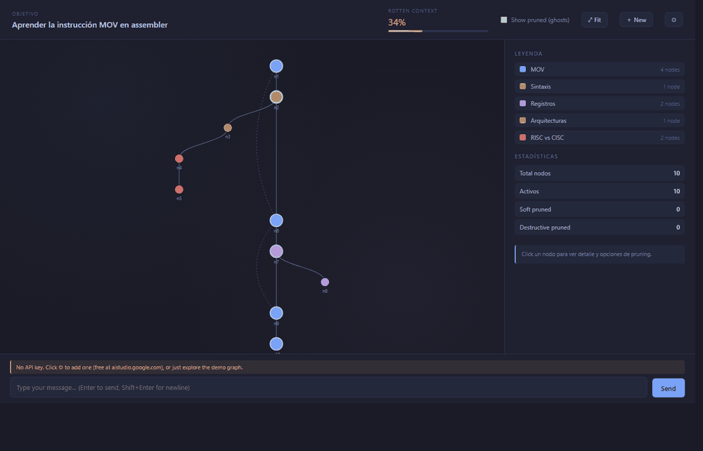
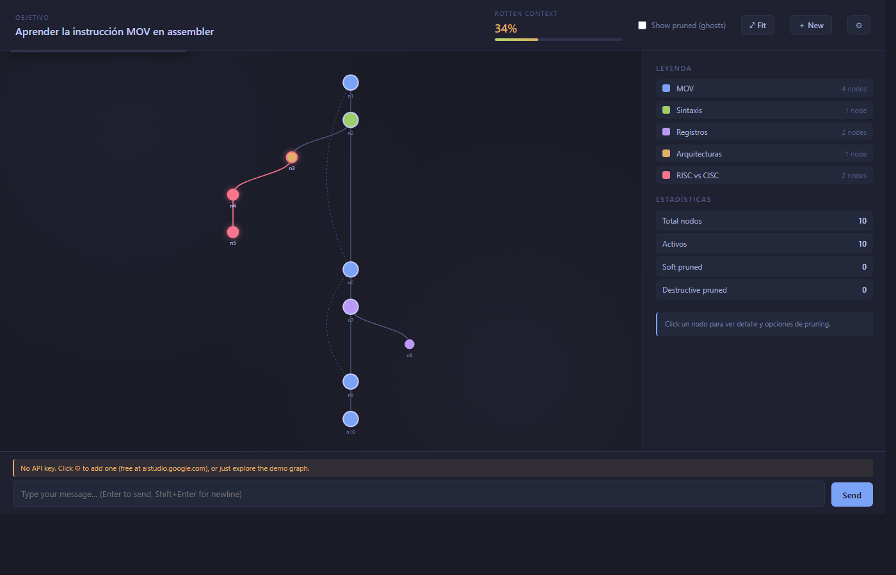
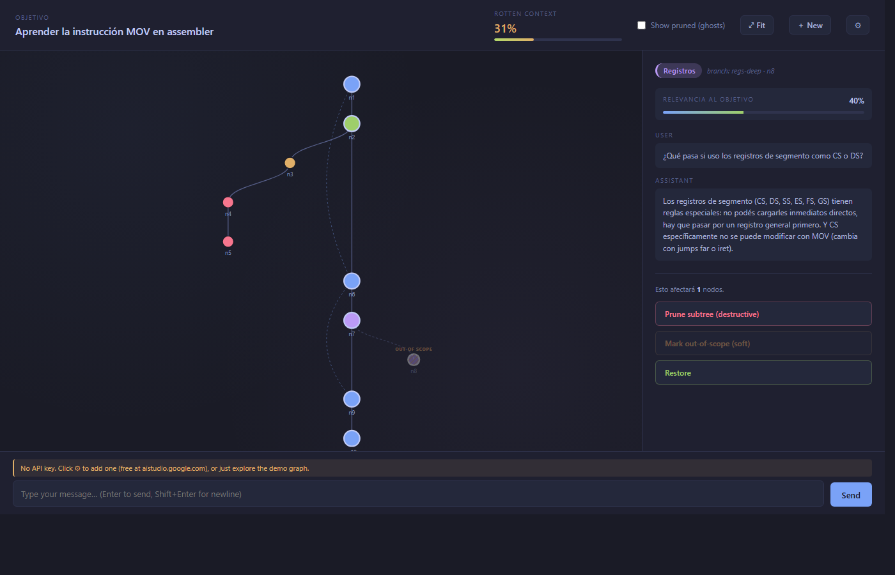
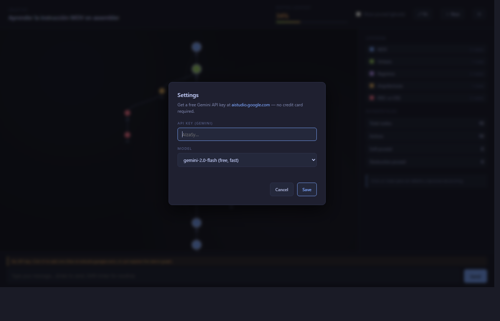

# bonsai

> Bonsai es el arte de podar un árbol para que crezca hacia una visión específica — no es jardinería pasiva, es escultura iterativa por sustracción. Eso es exactamente lo que hace esta herramienta: toma un árbol de conversación que crece sin control y te permite recortarlo para apuntar a un objetivo en concreto.

Una UI experimental para manejar el contexto de una conversación con un LLM como un grafo. Cada turno user/assistant es un nodo; las aristas conservan tanto el orden temporal como la similaridad temática (vía tags). Vos decidís qué ramas se mantienen y cuáles se podan, antes de que ensucien tu contexto.



## Demo paso a paso

**1. Estado inicial.** Sesión sobre la instrucción `MOV` en assembler. El LLM se fue por la tangente con ARM y de ahí saltó a RISC vs CISC. La barra de "Rotten Context" indica que **34%** del contexto activo no aporta al objetivo principal.


**2. Preview del prune.** Hacer hover sobre `n3` ilumina en rojo todo el subtree que sería removido si se hace click en "Prune subtree". Sin sorpresas: vés exactamente qué desaparecería antes de tocar el botón.



**3. Después de podar.** Click → la rama ARM y la sub-rama RISC vs CISC desaparecen. El layout se reacomoda. Rotten context cae a **12%** y el grafo queda enfocado en el objetivo original.


**4. Soft pruning.** Si querés excluir un nodo del contexto pero conservarlo visible para revisar después, "Mark out-of-scope" lo marca con un patrón de rayas y la etiqueta `OUT OF SCOPE`. Reversible con un click en "Restore".



## ¿Por qué?

En un chat lineal con un LLM, todo lo que escribiste y todo lo que respondió el modelo se acumula en el contexto. Si el modelo introduce una tangente interesante y vos la seguís por curiosidad, eso queda mezclado con tu objetivo principal y degrada las próximas respuestas. Las UIs de chat actuales no te dejan separar fácilmente el grano de la paja.

Bonsai modela la conversación como un grafo dirigido y te da herramientas para *podar* las ramas tangenciales:

- **Pruning destructivo** — la rama desaparece del contexto que ve el modelo en el siguiente turno.
- **Soft pruning (out-of-scope)** — la rama queda visible en el grafo pero excluida del contexto activo. Útil cuando dudás si descartarla del todo.
- **Restore** — devuelve la rama al estado activo.

Cada turno del LLM trae además metadata estructurada: un *tag* del tema, un flag de si fue tangente, y un score de relevancia al objetivo. Bonsai usa eso para colorear nodos por tema y calcular el *rotten context* — un indicador agregado de cuánta paja tenés acumulada (verde → amarillo → rojo).

## Quickstart

No hay build step. Es HTML + JS plano servido por cualquier servidor estático.

```bash
git clone https://github.com/andres-g-a/bonsai.git
cd bonsai
python -m http.server 5173
# abrir http://localhost:5173/
```

Por defecto carga una sesión mock (la del MOV en assembler) en modo demo. Podés explorar todas las features visuales sin API key — clickear nodos, podar, restaurar, hacer zoom/pan, etc.

## Conectar Gemini (free tier, sin tarjeta)

### Paso 1 — Obtener la API key

1. Andá a **[aistudio.google.com](https://aistudio.google.com/)**.
2. Iniciá sesión con cualquier cuenta de Google.
3. En el menú izquierdo, click **"Get API key"** (o el botón arriba a la derecha).
4. Click **"Create API key"** → elegís un proyecto o creás uno nuevo (el default está bien).
5. Copiás la key generada (formato: `AIzaSy...`).

> **Free tier:** 1500 requests/día y 15 RPM en `gemini-2.0-flash`. Sin necesidad de cargar tarjeta. Ver [límites actuales](https://ai.google.dev/gemini-api/docs/rate-limits).

### Paso 2 — Pegar la key en bonsai

Dos opciones, equivalentes:

**Opción A — Settings panel (recomendado).** Click en el ícono ⚙ del header. Pegá la key, opcionalmente cambiá el modelo, click "Save". Se guarda en `localStorage` de tu browser, no se sube a ningún lado.



**Opción B — Archivo local.** Útil si vas a compartir la máquina o querés versionarlo aparte:

```bash
cp config.example.js config.js
# editá config.js y pegá la key en el campo GEMINI_API_KEY
```

`config.js` está en `.gitignore` — nunca se commitea.

### Paso 3 — Empezar una sesión

Click en `＋ New` del header → definís el objetivo (ej. *"Aprender la instrucción MOV en assembler"*) → escribís el primer mensaje en la caja de abajo. Cada turno llama a Gemini, parsea el JSON estructurado `{answer, tag, is_tangent, relevance, continues_from}`, y crece el grafo en tiempo real.

## Features

- **Grafo timeline + temático** — eje Y temporal, eje X por rama. Aristas sólidas siguen la jerarquía padre-hijo; aristas punteadas conectan nodos con el mismo tag separados por una tangente.
- **Pruning con preview** — al hacer hover sobre un nodo se ilumina en rojo todo el subtree que sería removido. Sin sorpresas al clickear.
- **Rotten context bar** — mide `1 - avg(relevance de nodos activos)`. Cambia de verde a amarillo a rojo a medida que crece. Se actualiza en vivo cuando podás.
- **Out-of-scope badges** — los nodos soft-pruned quedan visibles con un patrón de rayas y la etiqueta `OUT OF SCOPE` para distinguirlos de los activos.
- **Zoom/pan** — el canvas se navega con wheel y drag (estilo Obsidian Graph). El botón ⤢ Fit re-centra todo.
- **Tag reuse** — cuando el LLM responde, se le pasa la lista de tags existentes y se le pide reutilizarlos cuando el tema coincide; sólo inventa uno nuevo si nada encaja.
- **Parent decision** — el grafo crece según: nodo seleccionado → `continues_from` que sugiera el LLM → último nodo activo. Permite "volver" a un punto previo y continuar desde ahí.

## Arquitectura

Sin frameworks pesados. Todo es estático.

```
bonsai/
├── index.html          # estructura + script tags
├── styles.css          # tema oscuro tipo Tokyo Night
├── mockdata.js         # sesión de ejemplo (10 turnos, 5 tags)
├── llm.js              # cliente Gemini, system prompt, response schema
├── graph.js            # estado dinámico, layout D3, render, pruning
├── app.js              # plumbing UI: chat input, modales, errores
├── config.example.js   # template para credenciales (copy → config.js)
└── config.js           # (gitignored) tu API key local
```

- **D3 v7** vía CDN para el grafo (zoom, layout, transiciones).
- **Gemini API** vía fetch directo desde el browser, con `responseSchema` para forzar JSON estructurado. Para producción haría falta un proxy server; para prototipar localmente con tu propia key alcanza.
- **Sin build step** — todo se sirve como archivos estáticos.

## Demo URL hashes

Útiles para reproducir screenshots o demostraciones sin tocar la UI:

| Hash | Efecto |
|---|---|
| `#demo-hover=<id>` | Simula hover sobre el nodo (resalta su subtree) |
| `#demo-prune=<id>` | Aplica pruning destructivo a ese subtree |
| `#demo-soft=<id>` | Aplica soft pruning a ese subtree y selecciona el nodo |
| `#demo-modal=settings` | Abre el modal de Settings al cargar |
| `#demo-modal=newsession` | Abre el modal de New session al cargar |

Ej: `http://localhost:5173/#demo-prune=n3` arranca con la rama ARM ya podada.

## Limitaciones / próximos pasos

Esto es un **prototipo** con scope acotado. Está fuera de alcance por ahora:

- Persistencia (recargar la página resetea la sesión).
- Multi-sesión / navegación entre objetivos.
- Export del grafo podado a un prompt limpio para otro LLM.
- Reconciliación de tags vía embeddings (cuando el LLM mete `mov-instruction` en un turno y `mov-x86` en otro para lo mismo).
- Auto-pruning sugerido (pintar nodos de baja relevancia con halo rojo y un botón "prune all rotten").
- Backend / proxy para no exponer la API key en el cliente.
- Soporte multi-provider (OpenAI, Anthropic).

## Licencia

Ver [LICENSE](LICENSE).
